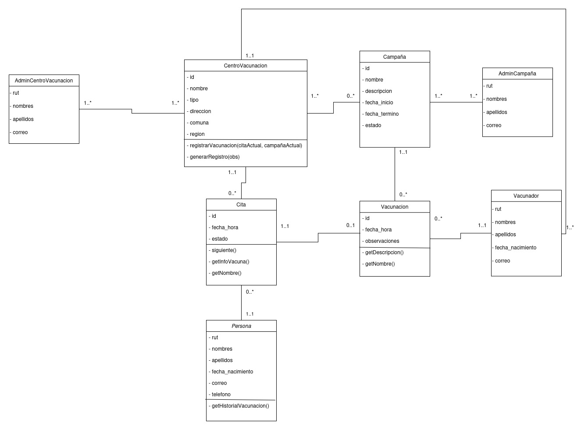
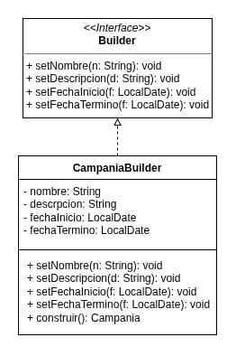
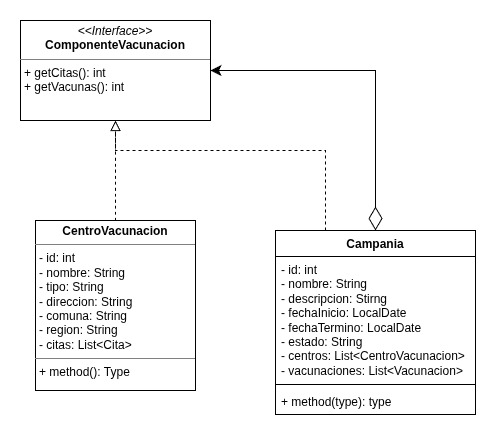
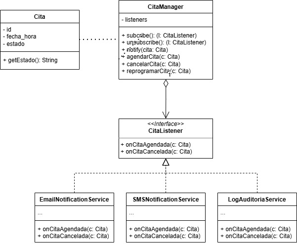

# Sistema de Gestión de Campaña de Vacunación

Entrega 2 — Diseño de Software · Universidad de Concepción

## Tabla de Contenidos

1. [Estructura del Proyecto](#estructura-del-proyecto)
2. [Instrucciones de Ejecución](#instrucciones-de-ejecución)
3. [Diagramas de Comunicación (GRASP)](#diagramas-de-comunicación-grasp)
   - [Diagrama 1 — Registrar Vacunación (Creacional)](#diagrama-1--registrar-vacunación-creacional)
   - [Diagrama 2 — Consultar Historial (Consulta)](#diagrama-2--consultar-historial-consulta)
4. [Diagrama de Clases Refinado](#diagrama-de-clases-refinado)
5. [Patrones de Diseño Aplicados](#patrones-de-diseño-aplicados)
   - [Builder (Creacional)](#builder-creacional)
   - [Composite (Estructural)](#composite-estructural)
   - [Observer (Comportamiento)](#observer-comportamiento)
6. [Descripción de Seguridad](#descripción-de-seguridad)
7. [Diagrama de Proceso BPMN](#diagrama-de-proceso-bpmn)

## Estructura del Proyecto

```
SistemaGestionCampanaVacunacion/
├── src/main/java/org/example/
│   ├── builder/
│   │   ├── Builder.java                  # Interfaz Builder
│   │   └── CampanaBuilder.java           # Implementación Builder para Campana
│   ├── manager/
│   │   └── CitaManager.java              # Controlador Observer para citas
│   ├── model/
│   │   ├── ComponenteVacunacion.java     # Interfaz Composite
│   │   ├── Campana.java                  # Nodo Composite
│   │   ├── CentroVacunacion.java         # Hoja Composite
│   │   ├── Cita.java
│   │   ├── Persona.java
│   │   └── Vacunacion.java
│   ├── observer/
│   │   ├── CitaListener.java             # Interfaz Observer
│   │   ├── EmailNotificacionListener.java
│   │   ├── SMSNotificacionListener.java
│   │   └── LogAuditoriaListener.java
│   └── Main.java
├── uml_patrones/
│   ├── patron_builder_uml.jpeg
│   ├── patron_composite_uml.jpeg
│   ├── patron_observer_uml.jpg
│   ├── DiagramaComunicacionCreacional.jpg
│   ├── DiagramaComunicacionConsulta.png
│   └── uml.jpeg
└── pom.xml
```

## Instrucciones de Ejecución

<!-- PENDIENTE: agregar instrucciones de compilación y ejecución una vez que Main.java esté completo -->

## Diagramas de Comunicación (GRASP)

### Diagrama 1 — Registrar Vacunación (Creacional)


Este diagrama modela el flujo **Registrar Vacunación**, el cual incluye una validación previa para evitar registros duplicados.

#### Patrones GRASP aplicados

**Controlador (Controlador de Fachada) → `CentroVacunacion`**

Se utiliza un controlador de fachada que representa el recinto físico donde ocurre el evento. `CentroVacunacion` es el primer objeto más allá de la capa de presentación (UI) que recibe el mensaje del sistema (`registrarVacunacion`). Su responsabilidad es coordinar el flujo delegando el trabajo a los objetos de dominio correspondientes, sin ejecutar la lógica de negocio por sí mismo.

**Experto en Información (Fase de Validación) → `Persona` y `Cita`**

Para validar si el paciente ya posee la vacuna solicitada, la responsabilidad de buscar en el historial recae en `Persona`, ya que es la experta que contiene la colección de sus propias citas. A su vez, cada `Cita` pasada es la experta que conoce si culminó en una `Vacunacion`, y esta última es la experta en conocer a qué `Campana` perteneció. Se respeta el encapsulamiento pidiendo a cada objeto su propia información.

**Creador → `Cita` (cita actual)**

La responsabilidad de instanciar el nuevo objeto `Vacunacion` (mediante el mensaje `<<create>>`) se asigna a `Cita`. Según GRASP, la clase B debe crear a la clase A si B registra, contiene o tiene los datos de inicialización de A. En este modelo, la cita registra el evento médico y posee el contexto del paciente y la fecha/hora.

**Experto en Información (Fase de Actualización) → `Campana`**

Una vez creada la vacuna (y solo si la validación fue exitosa), el sistema debe actualizar las métricas. Se le envía el mensaje `agregarVacunacion(nuevaVac)` a `Campana` porque es la experta responsable de agrupar y contabilizar el total de ciudadanos vacunados bajo su iniciativa.

#### Correspondencia mensaje → método

| Mensaje del diagrama | Método en código |
|---|---|
| `1.1: p := getPersona()` | `CentroVacunacion.registrarVacunacion(...)` valida `persona != null` |
| `1.2: historial := getCitas()` | `Persona.getCitas()` |
| `1.3: v := getVacunacion()` | `Cita.getVacunacion()` |
| `1.4: c := getCampana()` | `Vacunacion.getCampana()` |
| `1.5: generarRegistro(obs)` | `new Vacunacion(id, fecha, obs, campana)` |
| `1.5.1: <<create>> (fecha, obs)` | Constructor `Vacunacion(int, String, String, Campana)` |
| `1.6: agregarVacunacion(nuevaVac)` | `Campana.agregarVacunacion(nuevaVacunacion)` |


### Diagrama 2 — Consultar Historial (Consulta)


Este diagrama expone el flujo de comunicación al solicitar el historial de vacunación de una persona. Se verifican las citas de la persona en el sistema donde se realizó una vacunación. Cada una de las citas entrega una descripción de la vacuna, que incluye la id, la fecha, observaciones, el nombre de la campaña a la que pertenece y el centro de vacunación donde se llevó a cabo.

#### Patrones GRASP aplicados

**Experto en Información → `Cita`, `Vacunacion`, `CentroVacunacion`**

`Cita` actúa como el "puente" entre `Persona`, `Vacunacion` y `CentroVacunacion`. Es la experta que posee referencias directas a estas tres entidades, por lo que es quien puede contextualizar y articular la información del historial. La responsabilidad de obtener y conectar los datos recae en quien los posee: `Vacunacion` entrega la descripción, `Campana` entrega el nombre, y `CentroVacunacion` entrega el lugar.

**Bajo Acoplamiento**

Cada clase es responsable exclusivamente de su propia porción de información: `Vacunacion` no conoce a `Persona`, `CentroVacunacion` no conoce a `Vacunacion`. La dependencia existencial de `Cita` con `Vacunacion` no existe estructuralmente, lo que permite que cambios en una clase tengan bajo impacto en las demás.

**Alta Cohesión**

Al delegar a cada objeto la responsabilidad de entregar únicamente su propia información (`getDescripcion()`, `getNombre()` de campaña, `getNombre()` del centro), cada clase mantiene una responsabilidad única y bien definida. `Persona.getHistorialVacunacion()` orquesta sin asumir trabajo ajeno.

#### Correspondencia mensaje → método

| Mensaje del diagrama | Método en código |
|---|---|
| `getHistorialVacunacion()` | `Persona.getHistorialVacunacion()` |
| `1.*[cita.getVacuna != null] cita:=siguiente()` | Bucle `for (Cita cita : this.citas)` en `Persona` |
| `1.1: getInfoVacuna()` | `Cita.getVacunacion()` |
| `1.1.1: descripcion:=getDescripcion()` | `Vacunacion.getObservaciones()` |
| `1.1.1.1: nombre:=getNombre()` | `Campana.getNombre()` |
| `1.1.2: centroVacunacion:=getNombre()` | `CentroVacunacion.getNombre()` |


## Diagrama de Clases Refinado



El diagrama incorpora los métodos derivados de los mensajes de ambos diagramas de comunicación y la navegabilidad explícita en las asociaciones:

- `CentroVacunacion` expone `registrarVacunacion(citaActual, campañaActual)` y `generarRegistro(obs)`, derivados del diagrama creacional.
- `Cita` expone `siguiente()`, `getInfoVacuna()` y `getNombre()`, derivados del diagrama de consulta.
- `Vacunacion` expone `getDescripcion()` y `getNombre()`, correspondientes a los mensajes `1.1.1` y `1.1.1.1`.
- `Persona` expone `getHistorialVacunacion()`, punto de entrada del diagrama de consulta.

## Patrones de Diseño Aplicados

### Builder (Creacional)



**Problema que resuelve:** La construcción de una `Campana` requiere múltiples campos obligatorios. Sin un Builder, el código cliente tendría que pasar todos los parámetros en el constructor, lo que hace el código frágil ante cambios y difícil de leer cuando los campos crecen.

**Alternativa descartada:** Constructor telescópico (múltiples constructores sobrecargados). Se descartó porque aumenta el acoplamiento entre el cliente y la clase, y no permite validación centralizada antes de la creación.

**Ventaja:** El Builder permite construir el objeto paso a paso, validar que todos los campos requeridos estén presentes antes de instanciar, y en el futuro extender la lógica de construcción sin modificar `Campana`.

**Clases involucradas:**

| Clase | Rol | Ubicación |
|---|---|---|
| `Builder` | Interfaz con los métodos `set` | `org.example.builder` |
| `CampanaBuilder` | Implementación concreta + `construir(): Campana` | `org.example.builder` |
| `Campana` | Producto construido | `org.example.model` |


### Composite (Estructural)



**Problema que resuelve:** El sistema necesita consultar cuántas citas y vacunas tiene una campaña completa, sin tener que tratar de forma distinta a una campaña (que agrupa centros) y a un centro individual. Sin Composite, el cliente tendría que recorrer manualmente la jerarquía.

**Alternativa descartada:** Acumuladores externos que recorren las listas de centros desde fuera. Se descartó porque genera alto acoplamiento y rompe el encapsulamiento.

**Ventaja:** Con Composite, llamar `campana.getCitas()` o `campana.getVacunas()` delega automáticamente a cada `CentroVacunacion` hijo y suma los resultados. El cliente trata uniformemente a nodos y hojas a través de la interfaz `ComponenteVacunacion`.

**Clases involucradas:**

| Clase | Rol | Ubicación |
|---|---|---|
| `ComponenteVacunacion` | Interfaz Composite | `org.example.model` |
| `Campana` | Nodo (composite) — delega a hijos | `org.example.model` |
| `CentroVacunacion` | Hoja — retorna sus propios datos | `org.example.model` |


### Observer (Comportamiento)



**Problema que resuelve:** Cuando se agenda, cancela o reprograma una cita, múltiples servicios deben reaccionar (email, SMS, auditoría). Sin Observer, `CitaManager` dependería directamente de cada servicio, generando alto acoplamiento y haciendo imposible agregar nuevos canales sin modificar el manager.

**Alternativa descartada:** Llamadas directas desde `CitaManager` a cada servicio de notificación. Se descartó porque viola el principio Abierto/Cerrado y genera dependencias innecesarias.

**Ventaja:** `CitaManager` solo conoce la interfaz `CitaListener`. Agregar un nuevo canal de notificación implica únicamente crear una nueva clase que implemente `CitaListener` y suscribirla, sin tocar el manager.

**Clases involucradas:**

| Clase | Rol | Ubicación |
|---|---|---|
| `CitaListener` | Interfaz Observer | `org.example.observer` |
| `CitaManager` | Sujeto observable | `org.example.manager` |
| `EmailNotificacionListener` | Observer concreto | `org.example.observer` |
| `SMSNotificacionListener` | Observer concreto | `org.example.observer` |
| `LogAuditoriaListener` | Observer concreto | `org.example.observer` |

## Descripción de Seguridad

### 1. Identificación y Autenticación

El sistema utiliza el **RUT** como identificador único de cada usuario, dado que el Sistema Gubernamental (Registro Civil) ya posee la información personal de los pacientes y es la fuente autoritativa de identidad.

La autenticación se realiza en tres pasos sucesivos:

**Paso 1 — Verificación de identidad:** el backend consulta al Sistema Gubernamental enviando el RUT y la credencial del usuario. Si la identidad es válida, se reciben los datos personales de la persona.

**Paso 2 — Asignación de rol:** el backend consulta la base de datos interna para obtener el rol asociado a ese RUT. Si el RUT no existe con un rol asignado, el acceso es denegado.

**Paso 3 — Emisión de token:** el Controlador de Seguridad genera un JWT firmado con algoritmo HS256 que contiene el RUT (`sub`), el rol, el nombre del usuario, la fecha de emisión y la expiración (24 horas). El token es retornado al cliente sobre HTTPS.

### 2. Manejo de Sesión

El sistema adopta un modelo de sesión **sin estado (stateless)** basado en JWT. No se almacena estado de sesión en el servidor: cada solicitud incluye el token en el encabezado HTTP y el Controlador de Seguridad lo valida antes de procesar cualquier operación.

| Parámetro | Descripción |
|---|---|
| Duración de sesión | 24 horas, codificadas en el claim `exp` del JWT |
| Almacenamiento cliente | `flutter_secure_storage`, cifrado con el llavero del SO |
| Transmisión | Encabezado `Authorization: Bearer <token>`. Nunca en URL ni cookies |
| Cierre de sesión | Token eliminado del almacenamiento local del dispositivo |
| Token inválido / expirado | Retorna `401 Unauthorized` |
| Rol insuficiente | Retorna `403 Forbidden` |

### 3. Distinción de Roles

El sistema define cuatro roles con distintos niveles de privilegio. El rol queda codificado dentro del JWT en el claim `rol` y es verificado por el middleware en cada operación.

| Rol | Nombre en sistema | Descripción y alcance |
|---|---|---|
| Persona Usuaria | `paciente` | Puede ver sus propias citas e historial de vacunación. No accede a información de otros pacientes. |
| Personal de Vacunación | `vacunador` | Puede buscar pacientes por RUT y registrar vacunaciones en su centro asignado. |
| Coordinador de Centro | `coordinador` | Gestiona citas del centro asignado. No puede operar sobre otros centros. |
| Admin de Campaña | `admin` | Acceso completo para crear, modificar y supervisar campañas. Solo asignable directamente en BD. |

### 4. Control de Acceso por Rol (RBAC)

El Controlador de Seguridad implementa RBAC. Cada endpoint declara explícitamente qué roles pueden acceder. El middleware extrae el claim `rol` del JWT y verifica antes de ejecutar la lógica del controlador.

| Operación | Paciente | Vacunador | Coordinador | Admin |
|---|:---:|:---:|:---:|:---:|
| Ver mis citas y próximas vacunas | ✓ | — | — | ✓ |
| Ver mi historial de vacunación | ✓ | — | — | ✓ |
| Buscar paciente por RUT | — | ✓ | ✓ | ✓ |
| Registrar vacunación | — | ✓ | — | ✓ |
| Gestionar citas del centro asignado | — | — | ✓ (solo propio) | ✓ |
| Ver centros de vacunación | ✓ | ✓ | ✓ | ✓ |
| Modificar datos del centro | — | — | ✓ (solo propio) | ✓ |
| Crear / modificar campaña | — | — | — | ✓ |
| Consultar avance de campaña (agregado) | — | — | ✓ | ✓ |

### 5. Secuencia de Autenticación

**Fase 1 — Login:**

```
Cliente (Flutter)          Backend               Sistema Gubernamental / BD
       |                      |                            |
       |-- POST /auth/login -->|                            |
       |   {rut, password}     |-- verificar identidad(RUT) ->|
       |                      |<-- datos personales --------|
       |                      |-- consultar rol(RUT) -----> BD
       |                      |<-- rol asignado ----------- BD
       |                      |-- genera JWT(rut, rol, 24h)
       |<-- JWT ---------------|
       |   (guardado en        |
       |    flutter_secure_storage)
```

**Fase 2 — Operación protegida:**

```
Cliente (Flutter)          Controlador de Seguridad     Controlador de negocio
       |                            |                            |
       |-- solicitud + Bearer token ->|                          |
       |                            |-- valida firma JWT         |
       |                            |-- verifica exp             |
       |                            |-- extrae rol               |
       |                            |-- verifica permiso         |
       |                            |-- (si sensible) verifica centro
       |                            |-------------------------- >|
       |<-- resultado ---------------|                            |
```

### 6. Protección de Operaciones

El Controlador de Seguridad centraliza la lógica de autorización y actúa como middleware para todos los controladores internos (Citas, Vacunas, Centros, Campañas). Ningún controlador puede ser invocado sin pasar antes por la validación de seguridad.

- **Control fino por recurso — Paciente:** el claim `sub` (RUT) del JWT se compara con el RUT del recurso solicitado. Un paciente solo puede ver su propia información.
- **Control fino por recurso — Vacunador:** solo puede registrar vacunaciones en el centro asignado, verificando que el identificador de centro del token coincida con el de la cita.
- **Control fino por recurso — Coordinador:** las operaciones de escritura sobre Centros y Citas son filtradas por el identificador de centro del token.
- **Restricción del Admin:** no puede acceder a historiales médicos individuales; solo opera sobre campañas y métricas agregadas.
- **Trazabilidad:** toda operación sensible queda registrada junto con el RUT del usuario autenticado (`LogAuditoriaListener`).


## Diagrama de Proceso BPMN

<!-- PENDIENTE: agregar imagen del diagrama BPMN una vez disponible -->